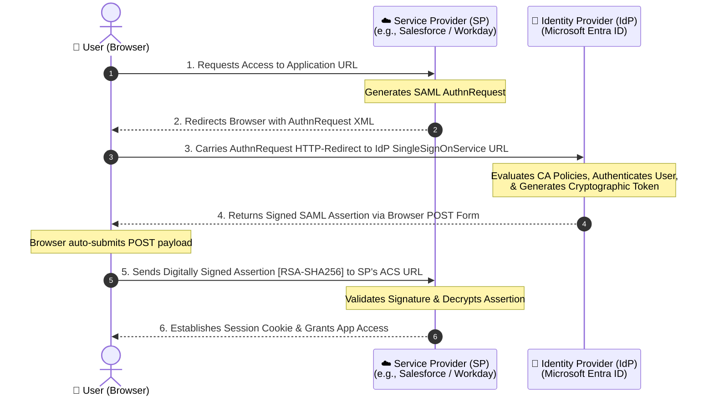

# 📓 Engineering Journal: SAML 2.0 Identity Federation Architecture, Lab Integration & Troubleshooting
 
**Author:** Identity & Access Management (IAM) Security Engineer  
**Date:** Day 3 Lab Deployment  
**Environment:** Microsoft Entra ID Hybrid-Cloud Sandbox (P2 Tier)  
**Core Frameworks:** SAML 2.0 Core Protocols, Oasis Open Standards, Zero-Trust Access Control
 
---
 
## Table of Contents
 
1. [Entry 1 — Core SAML 2.0 Architectural Blueprint](#-entry-1-core-saml-20-architectural-blueprint)
2. [Entry 2 — Hands-On Custom Enterprise Federation Build](#-entry-2-hands-on-custom-enterprise-federation-build)
   - [Step 1 — Provisioning the Custom Service Principal](#️-step-1-provisioning-the-custom-service-principal)
   - [Step 2 — Defining Endpoint Topography](#-step-2-defining-endpoint-topography-basic-saml-configuration)
   - [Step 3 — Engineering the Attributes & Claims Schema](#️-step-3-engineering-the-attributes--claims-schema)
   - [Step 4 — Exporting Cryptographic Primitives](#-step-4-exporting-cryptographic-primitives)
3. [Entry 3 — Advanced Diagnostic & Token Inspection](#-entry-3-advanced-diagnostic--token-inspection)
   - [Simulation Testing & In-Flight Interception](#-simulation-testing--in-flight-interception)
   - [Raw Decoded XML Assertion Blueprint](#-raw-decoded-xml-assertion-blueprint)
4. [Entry 4 — Real-World Incident Playbook](#-entry-4-real-world-incident-playbook)
   - [Case Study 1 — AADSTS650056: Audience Restriction Mismatch](#-case-study-1-error-aadsts650056--audience-restriction-mismatch)
5. [Architectural Sign-Off & Portfolio Value](#-architectural-sign-off--portfolio-value)
---
 
## 📅 Entry 1: Core SAML 2.0 Architectural Blueprint
 
### 🎯 Objective
 
Design and implement a secure, cross-domain Single Sign-On (SSO) trust boundary between **Microsoft Entra ID** as the Identity Provider (IdP) and a third-party cloud architecture (simulated via Salesforce metadata schema) acting as the Service Provider (SP).
 
---
 
### 🗺️ The Handshake Transaction Flow (SP-Initiated)
 
To understand token transmission and browser routing mechanics, I modeled the cryptographic handshake using the following sequence:
 

 
 
---
 
## 📅 Entry 2: Hands-On Custom Enterprise Federation Build
 
### 🛠️ Step 1: Provisioning the Custom Service Principal
 
I bypassed pre-configured gallery templates to build a raw federation connection from scratch — demonstrating the ability to federate any bespoke or non-standard legacy cloud app.
 
1. Navigate to **Identity → Applications → Enterprise applications → New application**.
2. Select the template: `Integrate any other application you don't find in the gallery (Non-gallery)`.
3. Object name: `SAML-Test-App-Salesforce`.
**What happens under the hood:** This initializes a brand-new **Service Principal Object** inside the tenant graph database, generating a unique Application ID and an isolated vault for cryptographic token-signing keys.
 
---
 
### 🌐 Step 2: Defining Endpoint Topography (Basic SAML Configuration)
 
I established precise data routing parameters to tie the IdP to the SP.
 
| Field | Value | Purpose |
|---|---|---|
| **Identifier (Entity ID)** | `https://example.com` | The unique global name that validates the target app's identity in the directory |
| **Reply URL (ACS URL)** | `https://example.com` | The secure landing endpoint where Entra ID delivers the token via automated browser form POST |
| **Sign-on URL** | `https://example.com` | The application's login entry point |
| **Logout URL** | `https://example.com` | Where Entra ID sends the user after logout |
| **Relay State** | `https://example.com` | Deep-link routing state that drops the authenticated user directly onto their correct dashboard page, bypassing generic index paths |
 
---
 
### 🗂️ Step 3: Engineering the Attributes & Claims Schema
 
To enable automated profile provisioning and attribute-driven role assignment, I built a data mapping matrix to pack real-world employee properties into the XML security token envelope.
 
**NameID Alignment:**  
Modified the **Unique User Identifier (Name ID)** format to `Email address`, anchoring the token's primary identity key to `user.mail`.
 
**Custom Claims Injection:**
 
| Claim Name | Entra ID Source Attribute | Purpose |
|---|---|---|
| `givenName` | `user.givenname` | Populates the app user profile first name |
| `surname` | `user.surname` | Populates the profile last name |
| `department` | `user.department` | Drives downstream in-app directory permissions |
| `jobTitle` | `user.jobtitle` | Provides governance data for compliance audits |
 
> **Engineering note:** Namespace prefixes were stripped from each claim to ensure clean attribute delivery — dirty namespaces cause claim mapping failures in some SPs.
 
---
 
### 🔐 Step 4: Exporting Cryptographic Primitives
 
To complete the trust loop from the IdP side, I captured the identity primitives needed by the SP administration team.
 
| Artifact | Value / Location |
|---|---|
| **Signing Certificate** | Downloaded `EntraID-SAML-SigningCert.cer` (Base64-encoded X.509). The SP uses this public key to verify that incoming tokens were signed by our private key tenant. |
| **IdP Login Endpoint** | `https://login.microsoftonline.com/{TENANT_ID}/saml2` |
| **Issuer ID** | `https://sts.windows.net/{TENANT_ID}/` |
| **Federation Metadata URL** | Copied from the SAML setup page — enables automated XML handshake configuration at the SP without manual field entry. |
 
---
 
## 📅 Entry 3: Advanced Diagnostic & Token Inspection
 
### 🧪 Simulation Testing & In-Flight Interception
 
To validate the claims engine without relying on external system logs, I executed the **built-in Entra SAML testing pipeline**.
 
When launching the full flow via the Microsoft My Apps launcher (`https://myapps.microsoft.com`), the browser successfully executed the IdP-initiated pipeline and routed to the ACS endpoint. Because the lab uses simulated placeholder domains, the browser hit an `ERR_NAME_NOT_RESOLVED` wall — expected behavior.
 
This created the exact opportunity to capture the raw `SAMLResponse` string and execute a **manual Base64 cryptographic inspection**.
 
**Decode method (PowerShell):**
 
```powershell
[System.Text.Encoding]::UTF8.GetString(
    [System.Convert]::FromBase64String('<paste-SAMLResponse-value-here>')
)
```
 
---
 
### 🔓 Raw Decoded XML Assertion Blueprint
 
The manual decode verified that the configuration compiled exactly as engineered:
 
```xml
<samlp:Response xmlns:samlp="urn:oasis:names:tc:SAML:2.0:protocol"
    ID="_a1b2c3d4..."
    Version="2.0"
    IssueInstant="2026-06-08T17:15:00Z">
 
  <saml:Issuer xmlns:saml="urn:oasis:names:tc:SAML:2.0:assertion">
    https://sts.windows.net/{TENANT_ID}/
  </saml:Issuer>
 
  <ds:Signature xmlns:ds="http://www.w3.org/2000/09/xmldsig#">
    <!-- Cryptographic Digital Signature Envelope [RSA-SHA256] -->
  </ds:Signature>
 
  <saml:Assertion xmlns:saml="urn:oasis:names:tc:SAML:2.0:assertion"
      ID="_assertion123..."
      IssueInstant="2026-06-08T17:15:00Z"
      Version="2.0">
 
    <saml:Subject>
      <saml:NameID Format="urn:oasis:names:tc:SAML:1.1:nameid-format:emailAddress">
        casey.newhire@<tenant>.onmicrosoft.com
      </saml:NameID>
    </saml:Subject>
 
    <saml:Conditions NotBefore="2026-06-08T17:10:00Z" NotOnOrAfter="2026-06-08T18:15:00Z">
      <saml:AudienceRestriction>
        <saml:Audience>https://example.com</saml:Audience>
      </saml:AudienceRestriction>
    </saml:Conditions>
 
    <saml:AttributeStatement>
      <saml:Attribute Name="department">
        <saml:AttributeValue>Sales</saml:AttributeValue>
      </saml:Attribute>
      <saml:Attribute Name="jobTitle">
        <saml:AttributeValue>Sales Representative</saml:AttributeValue>
      </saml:Attribute>
    </saml:AttributeStatement>
 
  </saml:Assertion>
</samlp:Response>
```
 
**Assertion validation checklist — all fields confirmed:**
 
| Field | Value Observed | Status |
|---|---|---|
| `Issuer` | `https://sts.windows.net/{TENANT_ID}/` | ✅ Matches IdP entity ID |
| `NameID` | `casey.newhire@<tenant>.onmicrosoft.com` | ✅ emailAddress format confirmed |
| `Audience` | `https://example.com` | ✅ Matches configured Entity ID |
| `NotOnOrAfter` | `2026-06-08T18:15:00Z` | ✅ Valid 60-minute window |
| `department` claim | `Sales` | ✅ Attribute mapping working |
| `jobTitle` claim | `Sales Representative` | ✅ Attribute mapping working |
| RSA-SHA256 Signature | Present | ✅ Cryptographic envelope intact |
 
---
 
## 📅 Entry 4: Real-World Incident Playbook
 
### 🚨 Case Study 1: Error `AADSTS650056` — Audience Restriction Mismatch
 
#### Incident Replication
 
Modified the application's **Identifier (Entity ID)** under Basic SAML Configuration to a misaligned string: `https://wrong-entity-id.com`.
 
**Observed symptom:** Launching the app via the My Apps dashboard halted immediately at the Entra ID security gateway with:
 
```
AADSTS650056 - Misconfigured application
```
 
---
 
#### 🔍 Root Cause Diagnostic
 
Federation trust boundaries enforce **absolute string parity**. Here is the chain of events that caused the failure:
 
```
Entity ID in Entra ID config  →  Injected into XML as <saml:Audience>
       ↓
Browser forwards token to SP
       ↓
SP compares <saml:Audience> against its own hardcoded local config
       ↓
String mismatch detected  →  SP drops the transaction
```
 
> **Key insight:** Entity ID comparison is **case-sensitive** and **whitespace/trailing-slash sensitive**. `https://example.com` and `https://example.com/` are treated as different strings by most SPs.
 
---
 
#### 🛠️ Resolution Protocol
 
1. Open the service principal dashboard for `SAML-Test-App-Salesforce`.
2. Navigate to **Single sign-on → Basic SAML Configuration → Edit**.
3. Delete the incorrect Entity ID string.
4. Extract the **exact** Entity ID value from the vendor's Federation Metadata XML file.
5. Paste it verbatim — enforce strict character matching (case, trailing slashes, protocol prefix).
6. Click **Save** and re-test via the My Apps launcher.
---
 
## 🏁 Architectural Sign-Off & Portfolio Value
 
By completing Day 3, I successfully demonstrated the capability to **architect, deploy, and troubleshoot** an enterprise-grade SAML 2.0 Single Sign-On federated pipeline end to end.
 
| Skill Demonstrated | Evidence |
|---|---|
| Custom non-gallery enterprise app federation | Built `SAML-Test-App-Salesforce` from scratch without gallery templates |
| Endpoint topology configuration | Configured Entity ID, ACS URL, Sign-on URL, Relay State |
| Attribute & claims schema engineering | Mapped `givenName`, `surname`, `department`, `jobTitle` to Entra ID schema paths |
| Cryptographic primitive export | Exported X.509 signing cert and federation metadata URL |
| Manual Base64 assertion decoding | Decoded raw `SAMLResponse` and validated all assertion fields |
| Live incident replication & resolution | Reproduced `AADSTS650056`, performed root cause analysis, and resolved |
 
---
 
*Engineering Journal — Microsoft Entra ID IAM Lab | SAML 2.0 | Day 3 Portfolio Artifact*
